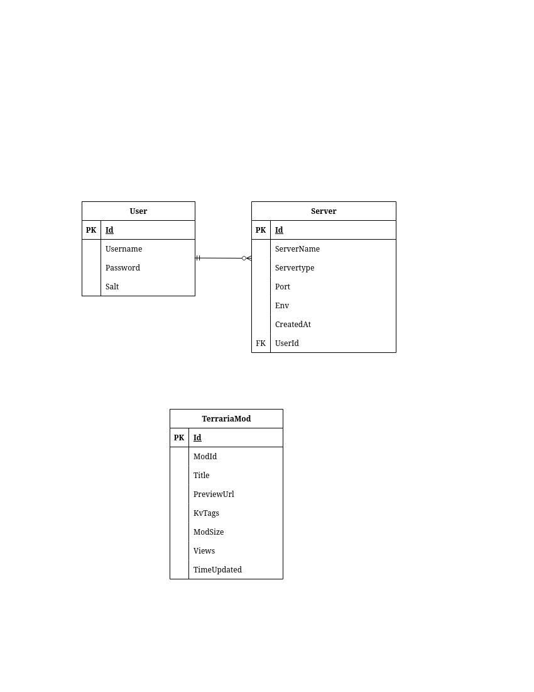

# NodeSentinel

## Project Overview

NodeSentinel is dedicated server hosting and monitoring tool. Users can create servers with ease and start playing their favorite games, without needing knowledge to setup server. Users can monitor and use server inside web-UI. NodeSentinel supports Terraria, tModLoader, Minecraft and Valheim server hosting.

## Hosting

Servers will be hosted on Azure. Virtual Machines will use Ubuntu server. I used one B1ms VM for web-server and larger B2s VM for server hosting. Docker container will be used to deploy servers. Caddy is used to create reverse-proxy. Both API and web-server started using Docker Compose.

## UI design

Main color palette for this project is tailwinds mist palette. Blue will be used as brand color. Design also includes obvious semantic colors for destructive action and etc. Project uses icons from Heroicons and Lucide. UI is created using html tailwind-css and JavaScript.

## Database

The database that this project uses is MongoDB. I chose MongoDB for this project due to its simplicity and not needing a SQL database. NoSQL is also great because i dont know database structure exactly. There will be tables with different data. For example Env data for servers ,which will be different for every server type.

## API

API is used so web-server and server manager can communicate with each other. My API is REST type. API is created on Dotnet MVC project. I used Openapi to create API schema and used kiota library to create C# classes from API-schema. Everything happening on servers sending commands and getting server data is using Docker API.

## Server creation
Servers are created using Docker and Dotnet Docker library. Docker dotnet is library that interacts with Docker API. I used pre-made opensource server images to create servers more easily.

## Backups
I just copy world save to other directory. When Restoring backups i stop server and override save file with backup file.

## Libraries & Dependencies

- ASP.NET MVC
- Docker.DotNet
- HTMX
- Openapi
- Kiota
- Chart.js
- MongoDB

## Architecture diagram

Visual structure of the project

## Database Schema

## Known limitations

- One server cant support many dedicated servers, due to one server infrastructure
- Minecraft backups dont work probably due to how minecraft servers save.
- Valheim backups are not tested, because i dont own Valheim :D.
- Valheim container does not allow manually saving from web-UI.
- Mods are fetched once and there is no logic for fetching it again. I had the data so why bother :D.
