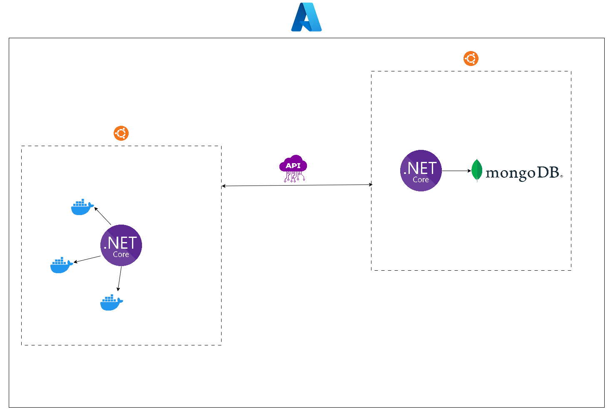

# NodeSentinel

## Project Overview

NodeSentinel is dedicated server hosting and monitoring tool. Users can create servers with ease and start playing their favorite games.

## Requirements

## Hosting

Servers will be hosted on Azure. Virtual Machines will use Ubuntu server.

## Database

The database that this project uses is MongoDB. I chose MongoDB for this project due to its simplicity and not needing Sql database.

## API

## Libraries & Dependencies

- Aspnet MVC
- Docker.DotNet
- Htmx
- Chartjs
- MongoDB

## Architecture diagram

## Database Schema

## Known limitations
